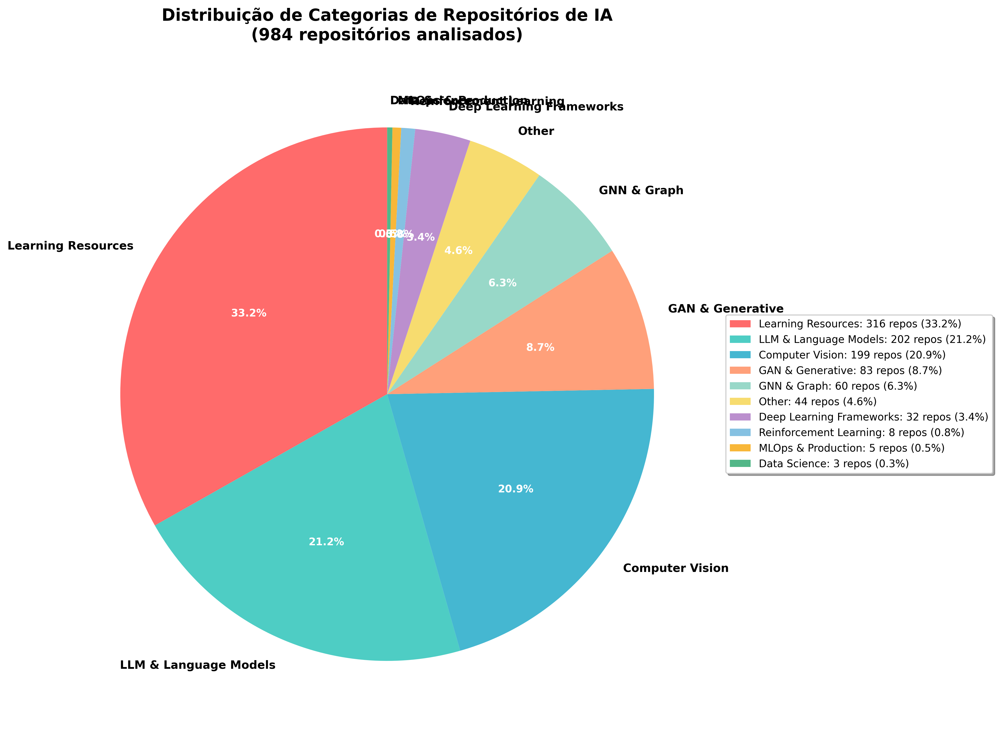
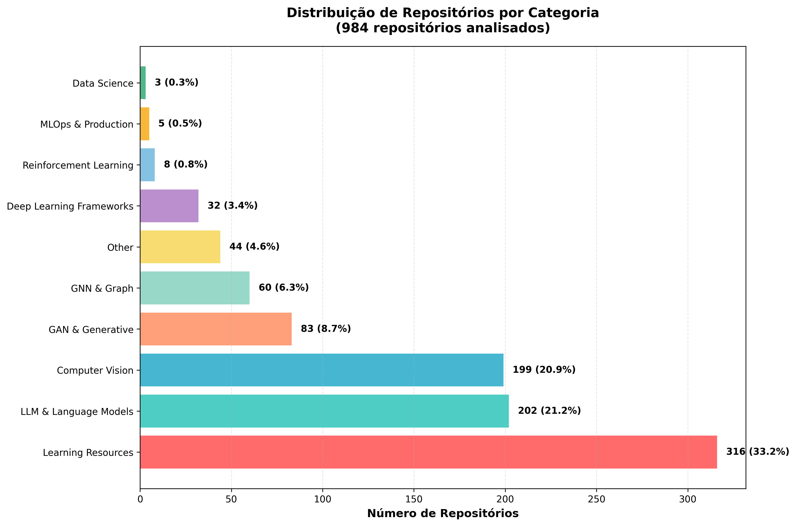

# Visão Geral da Organização - AIForge

**Data:** 31 de Outubro de 2025  
**Autor:** Manus AI

---

## 🚀 Introdução

Este documento fornece uma visão geral completa da organização do repositório **AIForge**, detalhando sua estrutura, estatísticas, e conteúdo. O objetivo é oferecer um guia claro para navegar e utilizar os **14.889+ recursos** disponíveis.

---

## 📊 Estatísticas Gerais

| Métrica | Valor |
|---|---|
| 🎯 **Total de Recursos** | 14.889+ |
| 📁 **Categorias Principais** | 5 |
| 📚 **Subtemas** | 23 |
| 📄 **Documentos** | 89 |
| ⭐ **Estrelas Combinadas** | 4.3M+ |

---

## 📂 Estrutura de Diretórios

O repositório está organizado em **5 categorias principais**, cada uma com seus subtemas:

### 1. 🏛️ 01 - FUNDAMENTOS (Foundations)

Base essencial para entender e trabalhar com IA.

- **1.1 Algoritmos:** 4.650+ recursos
- **1.2 Modelos Core:** 3.900+ recursos
- **1.3 Datasets:** 730+ recursos

### 2. 🎯 02 - APLICAÇÕES (Applications)

Modelos e ferramentas para domínios específicos.

- **2.1 Aplicações Especializadas:** 461 recursos
- **2.2 Modelos de Nicho:** 86 recursos
- **2.3 Aplicações na Indústria:** 8 recursos
- **2.4 Aplicações Financeiras:** 14 recursos

### 3. 📖 03 - RECURSOS (Resources)

Materiais de aprendizagem e referência.

- **3.1 Recursos de Aprendizagem:** 2.000+ recursos
- **3.2 Laboratórios Universitários:** 36 organizações
- **3.3 Diretórios de IA:** 12 diretórios
- **3.4 Plataformas de IA e Datasets:** 50+ plataformas
- **3.5 Humans vs AI Benchmarks:** 5 repositórios

### 4. 🌐 04 - ECOSSISTEMA (Ecosystem)

Plataformas, repositórios e recursos da comunidade.

- **4.1 Plataformas e Ferramentas:** 37 recursos
- **4.2 Meta Repositórios:** 1.000+ recursos
- **4.3 Repositórios SOTA 2025:** 35 repositórios
- **4.4 Ensemble Learning:** 33 recursos
- **4.5 Modelos Gerais de IA:** 113 recursos
- **4.6 Top Repositórios Ausentes:** 42 repositórios
- **4.7 Repositórios Enviados por Usuários:** 26 recursos
- **4.8 AutoML & Auto Learning:** 12 recursos

### 5. 🌟 17 - COLEÇÕES AVANÇADAS (Advanced Collections)

Coleções curadas dos melhores repositórios de IA.

- **Top 100 Repositórios de IA:** 100 repositórios (2.08M+ ⭐)
- **Recursos de Aprendizagem:** 50 repositórios (1M+ ⭐)

---

## 📈 Visualização da Distribuição de Categorias

### Gráfico de Pizza

### Gráfico de Barras

---

## 📚 Análise de Conteúdo Recente (pasted_content_20.txt)

- **Repositórios analisados:** 984
- **Total de stars:** 2.27M⭐
- **Categorias dominantes:**
  - **Learning Resources:** 33.2%
  - **LLM & Language Models:** 21.2%
  - **Computer Vision:** 20.9%

---

## ✅ Conclusão

O repositório **AIForge** está altamente organizado, com uma estrutura hierárquica clara, documentação abrangente e estatísticas atualizadas. Os gráficos de visualização ajudam a entender a distribuição do conteúdo, e a análise contínua de novos recursos garante que o repositório permaneça relevante e valioso para a comunidade de IA.

---

[↩️ Voltar para o README principal](./README.md)
